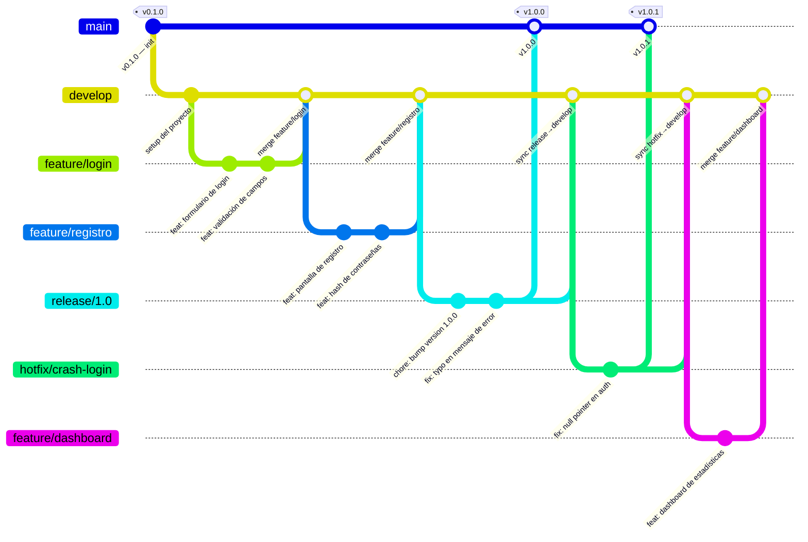
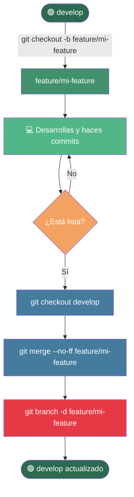
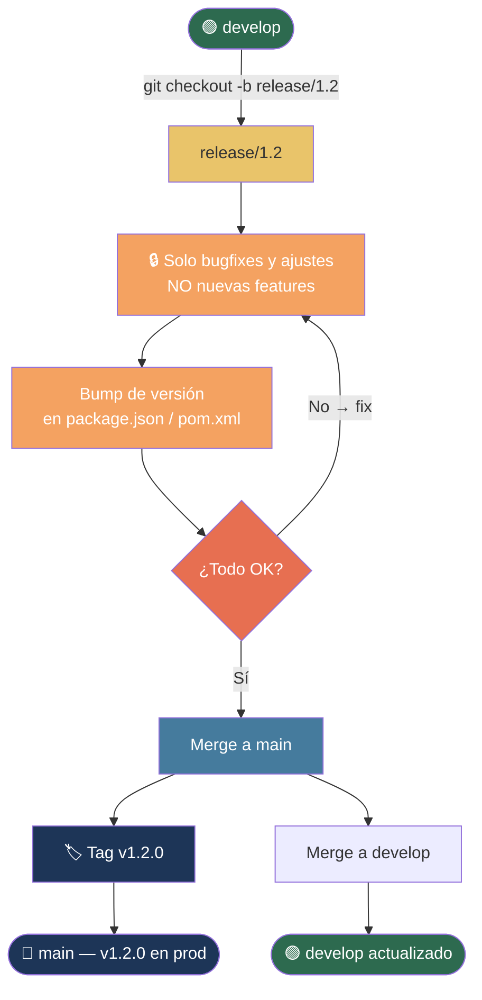
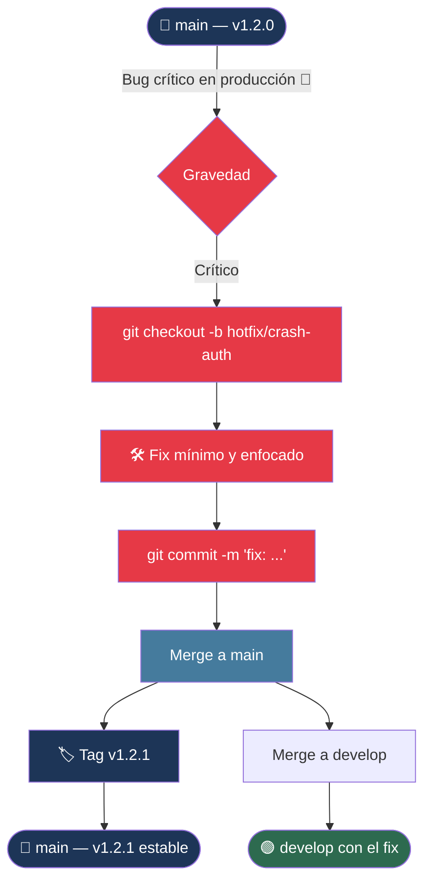
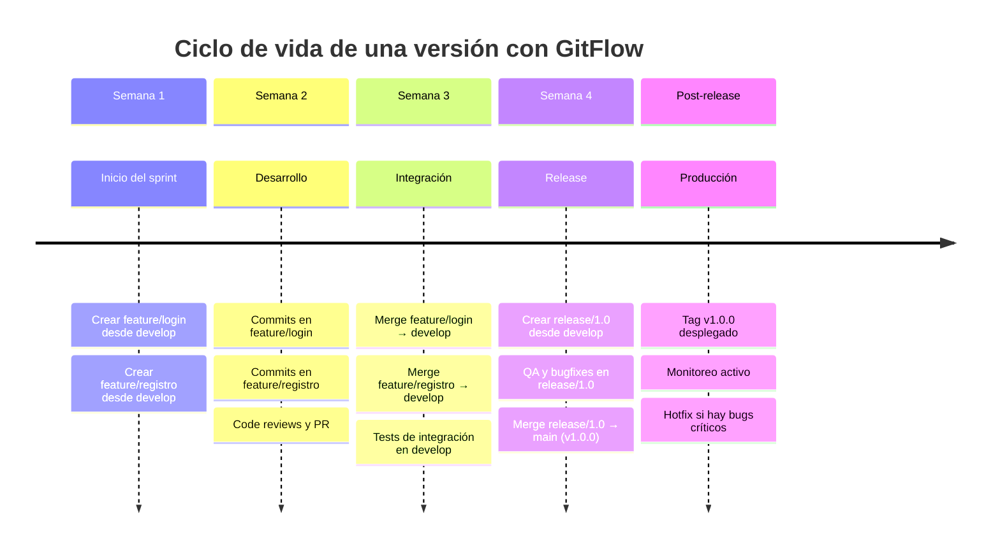
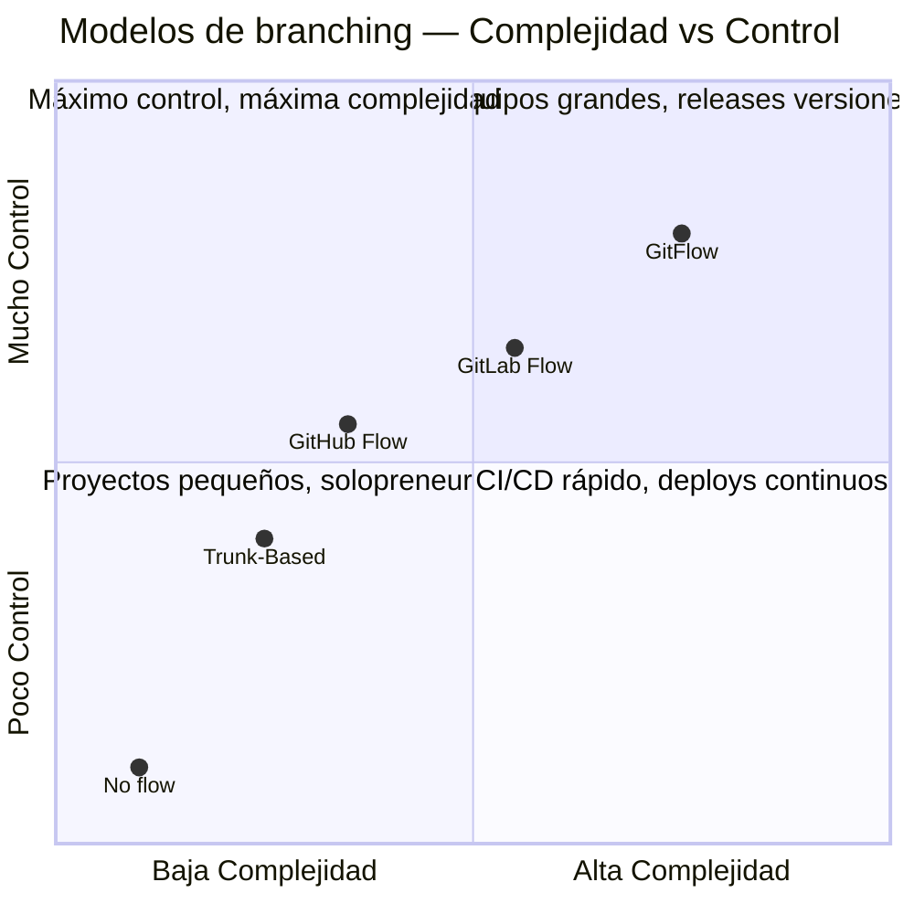
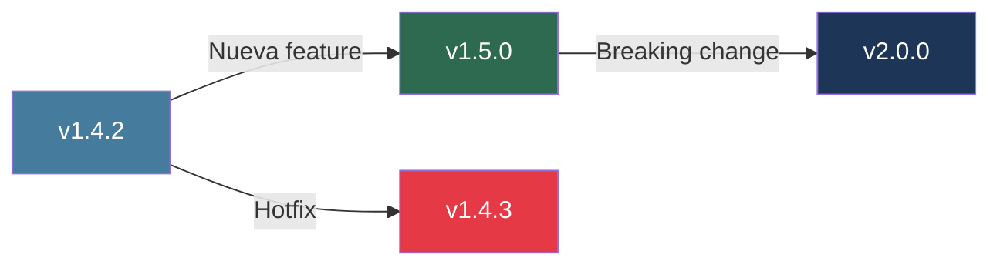

# 🌿 GitFlow — Guía Completa

> **GitFlow** es un modelo de ramificación para Git creado por **Vincent Driessen** en 2010.  
> Define una estructura estricta de ramas que facilita el trabajo en equipo, los releases y el mantenimiento paralelo de versiones.

---

## 📌 ¿Por qué usar GitFlow?

Sin un flujo definido, los repositorios en equipo tienden al caos:

| Problema sin GitFlow | Solución con GitFlow |
|---|---|
| Todos trabajan en `main` directamente | Nadie toca `main` salvo en releases |
| Features a medias llegan a producción | Cada feature vive en su propia rama |
| Es difícil hacer hotfixes urgentes | `hotfix/` permite parchear producción sin romper el desarrollo |
| Los releases son impredecibles | `release/` estabiliza el código antes de salir |
| El historial de commits es un desastre | Merge commits etiquetados clarifican qué fue cada cosa |

**Úsalo cuando:**
- Tienes un equipo de 2+ personas
- Tu proyecto tiene releases con versiones (`v1.0`, `v2.3`...)
- Necesitas mantener producción estable mientras desarrollas

**No lo uses cuando:**
- Haces deploys continuos (CI/CD puro) → prefiere **Trunk-Based Development**
- Trabajas solo en un proyecto personal pequeño

---

## 🏗️ Las 5 Ramas de GitFlow

```
main ──────────────────────────────────────────── producción estable (tags de versión)
develop ───────────────────────────────────────── integración continua de features
feature/xxx ──────────────────────────────────── desarrollo de funcionalidades
release/x.x ──────────────────────────────────── preparación para producción
hotfix/xxx ───────────────────────────────────── parches urgentes en producción
```

### Resumen de responsabilidades

| Rama | Origen | Merge hacia | Propósito |
|---|---|---|---|
| `main` | — | — | Código en producción. Siempre estable |
| `develop` | `main` | — | Base de integración. Siempre funcional |
| `feature/*` | `develop` | `develop` | Una feature, un ticket, una idea |
| `release/*` | `develop` | `main` + `develop` | Congela features, solo bugfixes |
| `hotfix/*` | `main` | `main` + `develop` | Parche urgente de producción |

---

## 📊 Diagrama General del Flujo



---

## 🔄 Flujos Individuales

### 1️⃣ Feature Branch — Nueva funcionalidad



**Comandos:**
```bash
# 1. Crear la rama desde develop
git checkout develop
git pull origin develop
git checkout -b feature/nombre-feature

# 2. Trabajar normalmente
git add .
git commit -m "feat: descripción del cambio"

# 3. Mergear de vuelta a develop
git checkout develop
git merge --no-ff feature/nombre-feature

# 4. Subir y limpiar
git push origin develop
git branch -d feature/nombre-feature
git push origin --delete feature/nombre-feature
```

---

### 2️⃣ Release Branch — Preparar un release



**Comandos:**
```bash
# 1. Crear release desde develop
git checkout develop
git checkout -b release/1.2.0

# 2. Ajustes de versión y bugfixes
# Editar versión en package.json, etc.
git commit -m "chore: bump version to 1.2.0"

# 3. Mergear a main y etiquetar
git checkout main
git merge --no-ff release/1.2.0
git tag -a v1.2.0 -m "Release version 1.2.0"

# 4. Mergear de vuelta a develop (para no perder los fixes)
git checkout develop
git merge --no-ff release/1.2.0

# 5. Limpiar
git branch -d release/1.2.0
git push origin main develop --tags
```

---

### 3️⃣ Hotfix Branch — Parche de emergencia



**Comandos:**
```bash
# 1. Crear hotfix desde main (NO desde develop)
git checkout main
git checkout -b hotfix/crash-autenticacion

# 2. Aplicar el fix
git commit -m "fix: null pointer en validación de token"

# 3. Mergear a main y tagear
git checkout main
git merge --no-ff hotfix/crash-autenticacion
git tag -a v1.2.1 -m "Hotfix: crash en autenticación"

# 4. IMPORTANTE: también mergear a develop
git checkout develop
git merge --no-ff hotfix/crash-autenticacion

# 5. Limpiar
git branch -d hotfix/crash-autenticacion
git push origin main develop --tags
```

---

## 📅 Ciclo de vida completo — Línea de tiempo



---

## 🏷️ Convención de nombres de ramas

```
feature/   → feature/nombre-descriptivo
             feature/login-con-google
             feature/dashboard-estadisticas
             feature/api-pagos

release/   → release/MAJOR.MINOR
             release/1.0
             release/2.3

hotfix/    → hotfix/descripcion-corta
             hotfix/crash-en-login
             hotfix/seguridad-jwt
             hotfix/null-pointer-auth

bugfix/    → bugfix/descripcion       (en develop, no urgente)
             bugfix/validacion-email
```

---

## 📝 Convención de commits (Conventional Commits)

GitFlow funciona mejor combinado con **Conventional Commits**:

```
<tipo>(<scope>): <descripción corta>

[cuerpo opcional]

[footer opcional]
```

| Tipo | Cuándo usarlo |
|---|---|
| `feat` | Nueva funcionalidad |
| `fix` | Corrección de bug |
| `chore` | Tareas de mantenimiento (deps, configs) |
| `docs` | Solo documentación |
| `refactor` | Refactorización sin cambio de funcionalidad |
| `test` | Agregar o corregir tests |
| `perf` | Mejora de rendimiento |
| `ci` | Cambios en CI/CD |

**Ejemplos:**
```bash
git commit -m "feat(auth): agregar login con Google OAuth"
git commit -m "fix(api): corregir null pointer en endpoint de usuarios"
git commit -m "chore: actualizar dependencias de seguridad"
git commit -m "docs: agregar guía de GitFlow"
git commit -m "refactor(db): extraer lógica de conexión a repositorio"
```

---

## 🔀 Comparación con otros modelos



| Modelo | Ideal para | Complejidad |
|---|---|---|
| **GitFlow** | Apps con versiones, equipos medianos/grandes | Alta |
| **GitHub Flow** | Deploys continuos, equipos ágiles | Baja |
| **GitLab Flow** | Entre GitFlow y GitHub Flow | Media |
| **Trunk-Based** | CI/CD puro, feature flags | Muy baja |

---

## ⚠️ Errores comunes y cómo evitarlos

### ❌ Hacer commits directamente en `main`
```bash
# MAL
git checkout main
git commit -m "fix rápido"

# BIEN — siempre por hotfix
git checkout -b hotfix/mi-fix
git commit -m "fix: descripción"
# → merge a main y a develop
```

### ❌ Crear features desde `main`
```bash
# MAL
git checkout main
git checkout -b feature/algo

# BIEN — siempre desde develop
git checkout develop
git checkout -b feature/algo
```

### ❌ Olvidar mergear el release/hotfix a `develop`
Esto causa que el fix se pierda en el próximo ciclo de desarrollo.
```bash
# Después de mergear a main, SIEMPRE:
git checkout develop
git merge --no-ff release/x.x  # o hotfix/xxx
```

### ❌ Features gigantes que duran semanas
Divide features grandes en sub-features. Ramas que viven demasiado generan conflictos monstruosos.

### ❌ Merge sin `--no-ff`
El flag `--no-ff` (no fast-forward) preserva el contexto histórico del merge:
```bash
# MAL — aplana el historial, pierdes contexto
git merge feature/login

# BIEN — crea un merge commit con contexto
git merge --no-ff feature/login -m "merge feature/login"
```

---

## 🚀 Setup rápido con git-flow CLI

Puedes usar la extensión `git-flow` para automatizar los comandos:

```bash
# Instalación
# macOS
brew install git-flow-avh

# Ubuntu/Debian
apt-get install git-flow

# Inicializar en tu repo (acepta los defaults con Enter)
git flow init

# === FEATURES ===
git flow feature start nombre-feature     # crea feature/nombre-feature
git flow feature finish nombre-feature    # merge a develop y borra rama

# === RELEASES ===
git flow release start 1.2.0             # crea release/1.2.0
git flow release finish 1.2.0            # merge a main+develop, tag, borra rama

# === HOTFIXES ===
git flow hotfix start crash-login        # crea hotfix/crash-login
git flow hotfix finish crash-login       # merge a main+develop, tag, borra rama
```

---

## 📋 Checklist por tipo de rama

### ✅ Antes de crear una feature
- [ ] Estoy en `develop` actualizado (`git pull origin develop`)
- [ ] El nombre describe claramente qué hace (`feature/autenticacion-jwt`)
- [ ] Tengo el ticket/issue de referencia

### ✅ Antes de mergear una feature a develop
- [ ] Los tests pasan localmente
- [ ] Hice `git pull origin develop` y resolví conflictos
- [ ] El código fue revisado (PR/MR aprobado)
- [ ] Usé `--no-ff` en el merge

### ✅ Antes de crear un release
- [ ] Todas las features del sprint están mergeadas en `develop`
- [ ] Los tests de integración pasan en `develop`
- [ ] Definí el número de versión (SemVer: MAJOR.MINOR.PATCH)

### ✅ Antes de cerrar un release
- [ ] QA aprobó el release branch
- [ ] Actualicé el número de versión en el código
- [ ] Mergeé a `main` Y a `develop`
- [ ] Creé el tag de versión
- [ ] Documenté el CHANGELOG

### ✅ Al crear un hotfix
- [ ] Parto desde `main` (no desde `develop`)
- [ ] El fix es mínimo y enfocado en el bug
- [ ] Mergeé a `main` Y a `develop`
- [ ] Incrementé el PATCH en la versión (v1.2.0 → v1.2.1)

---

## 🔢 Versionado Semántico (SemVer)

GitFlow usa tags que siguen **Semantic Versioning**:

```
v  MAJOR  .  MINOR  .  PATCH
v    1    .    4    .    2

MAJOR → cambios que rompen compatibilidad (breaking changes)
MINOR → nuevas features retrocompatibles
PATCH → bugfixes retrocompatibles (hotfixes)
```



---

## 📚 Referencias

- [A successful Git branching model](https://nvie.com/posts/a-successful-git-branching-model/) — Vincent Driessen (artículo original, 2010)
- [git-flow cheatsheet](https://danielkummer.github.io/git-flow-cheatsheet/)
- [Conventional Commits](https://www.conventionalcommits.org/)
- [Semantic Versioning](https://semver.org/)

---

*Documentado para el equipo EduConnect — Febrero 2026*