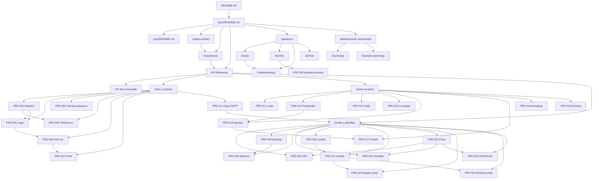

# Mapa grafico y relacional de documentacion

> Mapa para usar el repositorio como vault de Obsidian. Combina un diagrama Mermaid para lectura visual y wikilinks para que `Graph view` muestre las relaciones.

## Como leerlo

- Los nodos de `docs/` explican arquitectura, API, operacion y mantenimiento.
- Los nodos de `prds/` explican decisiones o alcance funcional por endpoint o flujo.
- Las relaciones no significan dependencia de codigo directa; indican que un cambio en un nodo normalmente exige revisar los nodos conectados.

## Grafo general

## Relaciones navegables

### Entrada y documentacion base

- [README principal](../README.md) -> [[docs/README|Indice de documentacion]] -> [Indice de PRDs](../prds/README.md).
- [[docs/System_Artifact|System Artifact]] se relaciona con [[docs/architecture|Arquitectura]], [[docs/API_REFERENCE|API Reference]], [[docs/docker|Docker]] y [[docs/alembic|Alembic]].
- [[docs/architecture|Arquitectura]] se relaciona con [[docs/API_REFERENCE|API Reference]] porque las rutas, controladores, servicios y repositorios descritos alli explican la referencia HTTP.
- [[docs/API_REFERENCE|API Reference]] se relaciona con [[docs/api_docs|API docs resumida]] como version extensa/resumida de contratos HTTP.

### Auth y usuario propio

- Flujo principal: [[prds/002-user-registration|PRD 002 Registro]] -> [[prds/005-email-verification|PRD 005 Verificacion]] -> [[prds/003-user-login|PRD 003 Login]] -> [[prds/006-auth-me|PRD 006 Auth me]] -> [[prds/007-user-profile|PRD 007 Perfil]].
- Seguridad y credenciales: [[prds/003-user-login|PRD 003 Login]] -> [[prds/004-change-password|PRD 004 Cambio de contrasena]].
- Envio por cuenta de usuario: [[prds/011-save-email-key|PRD 011 Clave SMTP personal]] -> [[prds/010-send-template-email|PRD 010 Envio con plantilla]] -> [[prds/022-send-email|PRD 022 Envio de email]].
- Documentos tecnicos: [[docs/API_REFERENCE|API Reference]], [[docs/System_Artifact|System Artifact]], [[docs/architecture|Arquitectura]].

### Administracion de usuarios

- Revision y aprobacion: [[prds/013-admin-list-pending-users|PRD 013 Pendientes]] -> [[prds/016-admin-approve-user|PRD 016 Aprobar usuario]].
- Administracion general: [[prds/012-admin-list-users|PRD 012 Listar usuarios]] -> [[prds/015-admin-get-user|PRD 015 Consultar usuario]] -> [[prds/018-admin-update-user|PRD 018 Actualizar usuario]].
- Estado y baja: [[prds/017-admin-change-user-status|PRD 017 Cambiar estado]] -> [[prds/019-admin-delete-user|PRD 019 Eliminar usuario]].
- Observabilidad funcional: [[prds/014-admin-user-stats|PRD 014 Estadisticas]] se relaciona con [[prds/012-admin-list-users|PRD 012 Listar usuarios]] y [[prds/013-admin-list-pending-users|PRD 013 Pendientes]].
- Documentos tecnicos: [[docs/API_REFERENCE|API Reference]], [[docs/System_Artifact|System Artifact]], [[docs/architecture|Arquitectura]].

### Emails, plantillas y trazabilidad

- Envio central: [[prds/022-send-email|PRD 022 Envio de email]] se relaciona con [[prds/025-email-send-form-endpoint|PRD 025 Separacion JSON/Form]], [[prds/001-pdf-attachments|PRD 001 Adjuntos PDF]] y [[prds/010-send-template-email|PRD 010 Envio con plantilla]].
- Consulta y gestion: [[prds/020-list-emails|PRD 020 Listado global]] -> [[prds/021-get-email-detail|PRD 021 Detalle]] -> [[prds/023-update-email-status|PRD 023 Actualizar registro]] -> [[prds/024-delete-email|PRD 024 Eliminar email]].
- Bandeja de usuario: [[prds/008-user-inbox|PRD 008 Bandeja de salida]] -> [[prds/009-resend-email|PRD 009 Reenvio]].
- Documentos tecnicos: [[docs/API_REFERENCE|API Reference]], [[docs/System_Artifact|System Artifact]], [[docs/architecture|Arquitectura]], [[docs/TROUBLESHOOTING|Troubleshooting]].

### Base de datos, migraciones y operacion

- [[prds/026-alembic-schema-alignment|PRD 026 Alembic/schema]] es la decision de producto/infraestructura que conecta [[docs/alembic|Alembic]], [[docs/docker|Docker]], [[docs/TROUBLESHOOTING|Troubleshooting]] y [[docs/System_Artifact|System Artifact]].
- [[docs/alembic|Alembic]] se debe revisar junto con `alembic/`, `alembic.ini`, `database.sql`, `app/models/` y `app/config/database/`.
- [[docs/docker|Docker]] y [[docs/TROUBLESHOOTING|Troubleshooting]] se revisan juntos cuando cambia la ejecucion local, PostgreSQL, SMTP o plantillas.

### Documentacion y mantenimiento

- [[docs/docstring_guide|Docstrings]] y [[docs/STYLE_DOSCTRINGS_GUIDE|Estandar de docstrings]] se revisan al cambiar documentacion de rutas o descripciones de Swagger.
- [[docs/gitflow|GitFlow]] se relaciona con los PRDs porque cada PRD debe poder rastrearse a cambios pequenos y coherentes.

## Convencion para nuevos enlaces

- Agregar cada documento nuevo al [[docs/README|Indice de documentacion]].
- Agregar cada PRD nuevo al [Indice de PRDs](../prds/README.md).
- Enlazar desde este mapa cualquier documento que comparta flujo, contrato, dato, actor o responsabilidad operacional.
